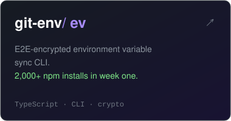
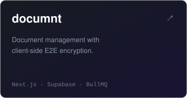
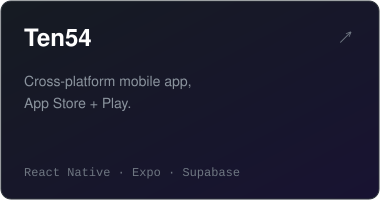
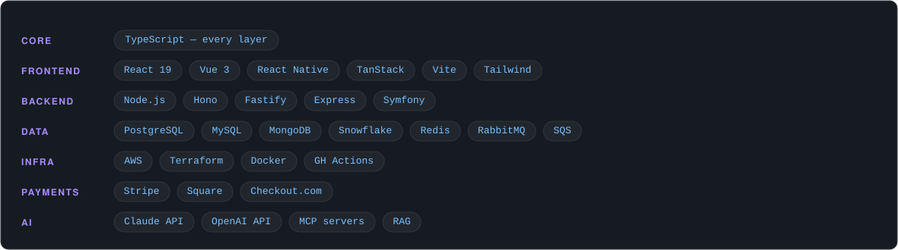

<picture>
  <source media="(prefers-color-scheme: dark)" srcset="assets/hero-dark.svg">
  <source media="(prefers-color-scheme: light)" srcset="assets/hero-light.svg">
  
</picture>

Full-stack TypeScript engineer in Houston, TX. I lead platform architecture at **[Fishbowl](https://fishbowl.com)** — designing the systems, API contracts, and infrastructure patterns behind a restaurant engagement platform serving 5,500+ locations. Previously at MHVillage and Triskelle Software Solutions.

<a href="https://git-env.com"><picture>
  <source media="(prefers-color-scheme: dark)" srcset="assets/card-git-env-dark.svg">
  <source media="(prefers-color-scheme: light)" srcset="assets/card-git-env-light.svg">
  
</picture></a><a href="https://documnt.app"><picture>
  <source media="(prefers-color-scheme: dark)" srcset="assets/card-documnt-dark.svg">
  <source media="(prefers-color-scheme: light)" srcset="assets/card-documnt-light.svg">
  
</picture></a><a href="https://ten54.app"><picture>
  <source media="(prefers-color-scheme: dark)" srcset="assets/card-ten54-dark.svg">
  <source media="(prefers-color-scheme: light)" srcset="assets/card-ten54-light.svg">
  
</picture></a>

<picture>
  <source media="(prefers-color-scheme: dark)" srcset="assets/stack-dark.svg">
  <source media="(prefers-color-scheme: light)" srcset="assets/stack-light.svg">
  
</picture>

---

[mail.browland@gmail.com](mailto:mail.browland@gmail.com)
